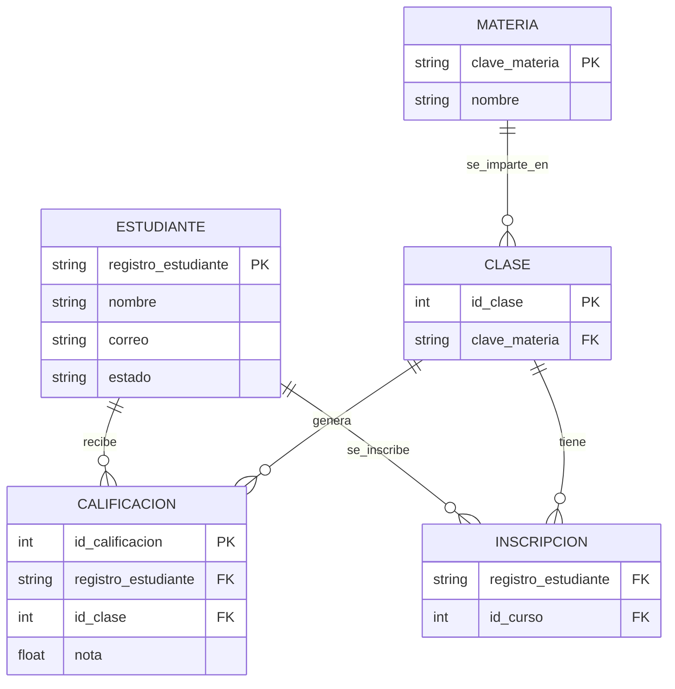

<div align="center">

# 🎓 School Early-Warning API

### A FastAPI service that turns raw grade data into actionable academic alerts.

**Python 3.13 · FastAPI · MySQL · uv**

[](https://fastapi.tiangolo.com/)
[](https://www.python.org/)
[](https://dev.mysql.com/doc/connector-python/en/)
[](https://docs.astral.sh/uv/)

</div>

---

## What this is

A focused, single-file FastAPI service (`App Early Warning System`) that sits on top of a relational school database and exposes three analytical endpoints a real academic-advising office would actually want: who's failing right now, which subjects are causing the most failures, and which active students are quietly drifting toward dropping out. It's intentionally small — the value here isn't volume of code, it's the SQL: every endpoint is a non-trivial query (multi-table joins, aggregation with `HAVING`, and an anti-join via `NOT IN`) rather than a wrapper around `SELECT *`.

## Endpoints

| Method | Endpoint | What it answers |
|---|---|---|
| `GET` | `/analitica/alumnos-riesgo` | "Which students currently have a failing average?" — joins `Estudiante` to `Calificacion`, groups by student, and filters to averages below 7.0 with `HAVING`. |
| `GET` | `/analitica/materias_criticas` | "Which 5 subjects produce the most failing grades?" — joins `Materia` → `Clase` → `Calificacion`, counts grades under 7.0 per subject, ranked descending. |
| `GET` | `/analitica/desercion_potencial` | "Which active students haven't enrolled in [a tracked course] and may be disengaging?" — an anti-join (`NOT IN`) between `Estudiante` and `INSCRIPCION`. |

<details>
<summary><b>Example response — <code>/analitica/alumnos-riesgo</code></b></summary>

```json
{
  "estatus": "alerta",
  "total_en_riesgo": 2,
  "alumnos": [
    { "nombre": "Ana López", "registro_estudiante": "20231045", "promedio": 6.2 },
    { "nombre": "Luis Pérez", "registro_estudiante": "20231102", "promedio": 5.8 }
  ]
}
```
</details>

<details>
<summary><b>Example response — <code>/analitica/materias_criticas</code></b></summary>

```json
{
  "reporte": "Top 5 Materias Críticas",
  "materias_criticas": [
    { "materia": "Cálculo II", "total_reprobados": 14 },
    { "materia": "Física I", "total_reprobados": 9 }
  ]
}
```
</details>

<details>
<summary><b>Example response — <code>/analitica/desercion_potencial</code></b></summary>

```json
{
  "analisis": "Posible abandono escolar",
  "alumnos_a_contactar": [
    { "registro_estudiante": "20231078", "nombre": "Marco Ruiz", "correo": "marco.ruiz@school.edu" }
  ]
}
```
</details>

## Data model

There's no ORM here — every query talks directly to MySQL via `mysql-connector-python`, which means the schema below is reverse-engineered from the joins themselves rather than copy-pasted from a DDL file:



## Tech stack & design choices

| Concern | Choice | Why it's worth noting |
|---|---|---|
| Web framework | FastAPI | Auto-generated OpenAPI docs at `/docs` for free |
| Database driver | `mysql-connector-python` | Raw SQL, no ORM — every query above is hand-written |
| Config | `python-dotenv` | Credentials (`DB_HOST`, `DB_USER`, `DB_PASSWORD`, `DB_NAME`) are read from environment variables, never hardcoded |
| Dependency management | `uv` | Reproducible installs via `pyproject.toml` + `uv.lock` |
| Data tooling | `pandas` | Pulled in for the heavier analytics this API is meant to grow into (cohort trends, GPA distributions) |

## Getting started

```bash
git clone https://github.com/robertojimenez2/db-escuela.git
cd db-escuela
uv sync
```

Create a `.env` file in the project root pointing at your MySQL instance:

```env
DB_HOST=localhost
DB_USER=root
DB_PASSWORD=your_password
DB_NAME=escuela
```

Run it:

```bash
uv run uvicorn main:app --reload --port 8000
```

Interactive docs: `http://localhost:8000/docs`

## Roadmap

This is a small, deliberately scoped project — the natural next steps if it grew further:

- Pydantic response models instead of raw dicts, for typed/validated API responses
- Parameterize the hardcoded `id_curso = 9` filter in the dropout-risk query
- Pagination for the at-risk-students endpoint as the dataset grows
- A `schema.sql` / migration file so the data model in this README is verifiable, not inferred
- Basic test coverage with a mocked connection (similar in spirit to the test setup in my [RobertCare](https://github.com/robertojimenez2/servicios_medicos_full_stack) project)

## Author

**Roberto de Jesús Jiménez Real**
A focused exercise in writing SQL that does real analytical work — joins, aggregations, and anti-joins — instead of just standing up a basic CRUD API.
